# Walkthrough for running Joinmarket-Qt to do coinjoins (single or tumbler)

### Binary or script

The gui can be run directly from Python script by doing `python joinmarket-qt.py` from within `scripts/`, or by running the executable file/binary (**[CLICK HERE](https://github.com/AdamISZ/joinmarket-clientserver/releases/)** to download the latest release).

**LATEST VERSION of JoinMarket-Qt is GUI version 16**. You can check the version via `About` in the menu.

No other files / setup should be needed. You might need to `chmod 755` on Linux.

The github commits to the main repo, above, are signed.

**Contents**

* [Walkthrough](#walkthrough) - for starting out.

* [Tumbler](#tumbler) - basic walkthrough for the tumbler feature in the GUI.

* Other features

  * [Sweeps](#sweeps)

  * [Coins tab](#coins-tab)
 
  * [Exporting private keys](#export-private-keys)

### Walkthrough

Ensure Bitcoin Core is running, and synced. (Your version of Bitcoin Core must be compiled with wallet support).

Double click the binary to run it, or go to the `/scripts` subdirectory and run `python joinmarket-qt.py`
(make sure you're in the venv, go back to the README quick install instructions if you don't know what that means).

You will get the following error screen initially:

... because your rpc connection to Bitcoin Core is not set up. A `joinmarket.cfg` file
has been created in your Joinmarket data directory (see [here](USAGE.md#data)). If you're running Bitcoin Core, open it and edit:

    [BLOCKCHAIN]
    rpc_user = yourusername-as-in-bitcoin.conf
    rpc_password = yourpassword-as-in-bitcoin.conf
    rpc_host = localhost #default usually correct 
    rpc_port = 8332 # default for mainnet

Before restarting though, you're strongly advised to make the configuration change explained [here](USAGE.md#setting-core-wallet), this
may avoid possible RPC errors (indeed, read the whole of that section on "Configuring for Bitcoin Core").

Once the rpc connection is correct, and you restart, you will be presented with this start screen:

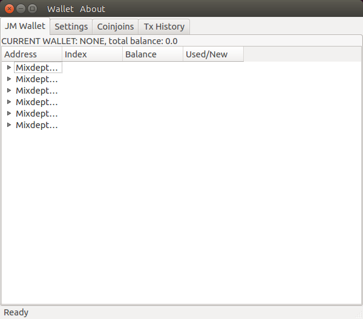

Note "CURRENT WALLET: NONE" means no joinmarket wallet is loaded yet. Assuming you haven't
yet created one, do Wallet->Generate (otherwise, do Wallet-->Load):

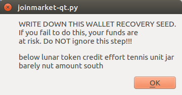

This list of 12 words allows you to recreate the wallet in future. **WRITE IT DOWN and do not 
lose it under any circumstances**! (This seedphrase has the same function as for all other
HD wallets, like Electrum, Trezor etc. The seedphrase should be compatible with Trezor, Ledger, Electrum, Samourai and some others).

Next, enter a password for encrypting the wallet:

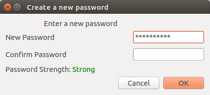

Losing this password means you won't be able to access this wallet file and will cause
inconvenience, but you'll still be able to recover the coins with the above seedphrase.

Next, give a name for your wallet file:

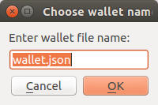

The wallet file will be saved with this name under the directory `wallets` in the same data directory as mentioned above.

Joinmarket wallet file names are .json by default; this isn't strictly necessary, but better to 
stick to that convention.

The wallet will now automatically load from the your Bitcoin Core node. It may take a few seconds, during which you'll see "Reading wallet from blockchain...".

If JoinMarketQt gets stuck at "Reading wallet from blockchain..." state, one possible solution may be to ensure you have set `rpc_wallet_file` correctly
as described above. You can also check the terminal you ran the `joinmarket-qt.py` script from for other error messages.

Since you just created it, it will have no coins initially:

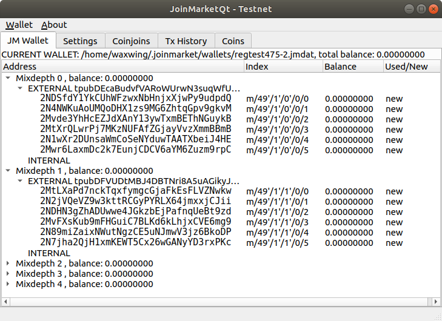

Start out by putting some coins into the first address in the "EXTERNAL" section 
of mixdepth 0. Once you have coins in the wallet it will show something like this 
(after a few transactions):

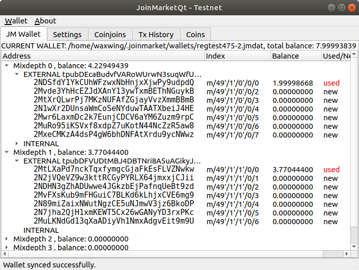

This is a good time to explain "EXTERNAL" and "INTERNAL"; external is for paying in. 
Use the 'new' addresses to ensure no address reuse, when you want to pay into the wallet.
When paying out, Joinmarket will take coins from *both* from the internal and external. 
The long string after "EXTERNAL" and "INTERNAL" are the "xpub" keys that can be used in
some advanced ways (they can be exported to allow watching accounts, for example).

Next (and you could have done this at the start), take a look at the "Settings" tab.

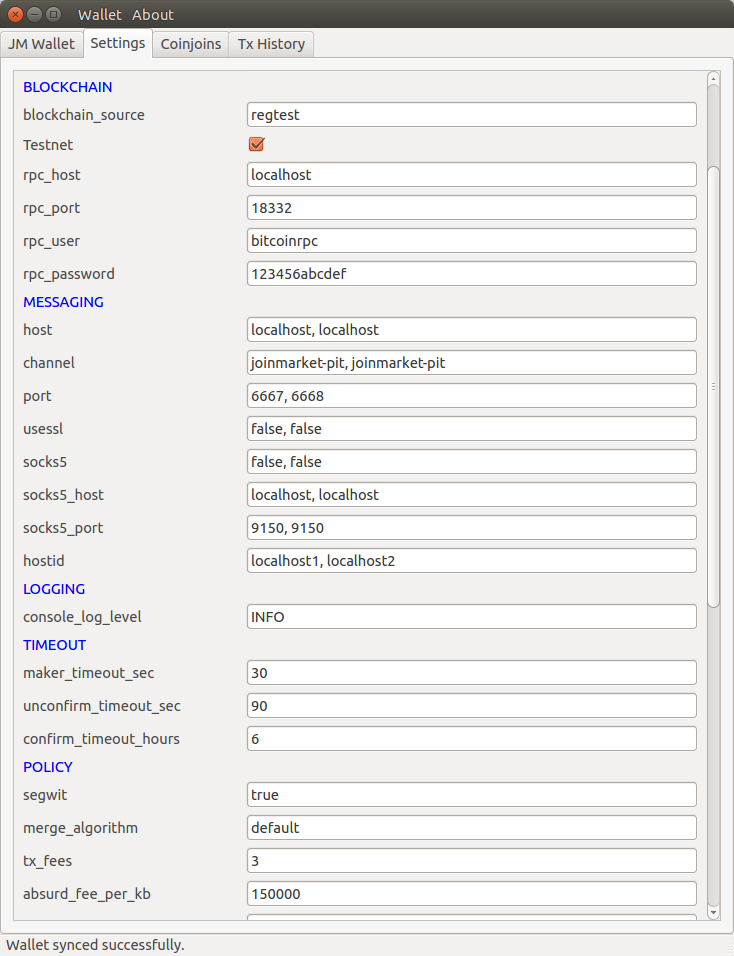

(This is a testnet/regtest example; your settings will look different on mainnet).

The tooltips seen by hovering the mouse give brief explanations of all the settings.

There are a lot of settings, most of which can be left default. Here are some notes:

* Section **DAEMON** - best ignore this for now, advanced usage.

* Section **BLOCKCHAIN** - You made the necessary edits at the start. Also, the application is compatible with Testnet, if you check that box. Note however that there isn't currently an active testnet trading pit, although this changes from time to time.

* Section **MESSAGING** - here you can choose the IRC servers, the default 2 should be fine. Note how all the settings are comma-separated lists, they have to match in number (i.e. 2 entries for *all* or 3 for *all* etc.). If you want to connect over Tor, use the socks proxy options. See the notes on that in the `joinmarket.cfg` file.

* Section **LOGGING** - only one option here, leave it INFO or change to DEBUG if you wanted detailed logging output.

* Section **TIMEOUT** - leave this as-is (some options are deprecated anyway).

* Section **POLICY** - You might want to change `tx_fees`. Hover over the setting for the tooltip explanation.

* Section **GUI** - these aren't GUI specific as the name suggests, and one or two are important. `gaplimit` is how far forward to search for used addresses on each branch before giving up; you're unlikely to need to change this. `history_file` is the name of the file in which the history of transactions you've performed is being recorded in plaintext. Consider the privacy implications. `check_high_fee` is a sanity check that the percentage fee you're being charged by counterparties isn't above that percent limit. `max_mix_depth` is how many "mixdepths" (or accounts) you have in your wallet. The default, 5, will be fine for most people. `check_tx` is whether to block processing and look at the fees in detail before accepting; this should usually be used for single coinjoins, but will not be used for tumbling.

Next, we'll send a test transaction:

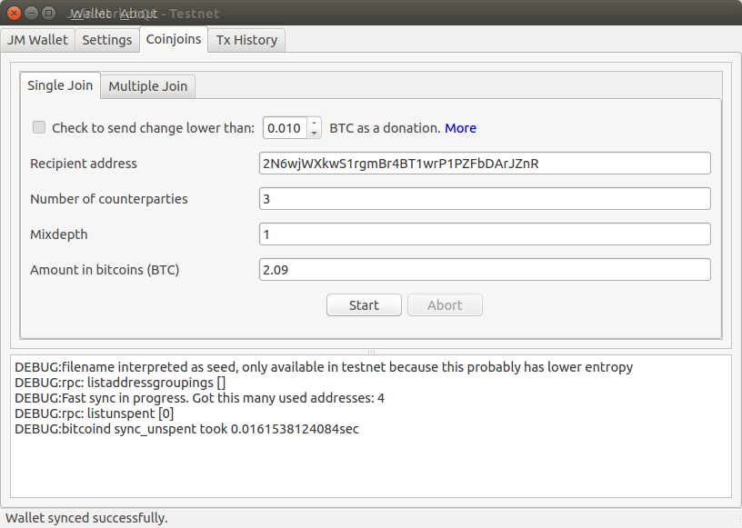

In the Coinjoins tab, select the "Single Join" subtab.

The donation feature is disabled; you can donate to the general JM donation address found in the `About` window from the menu.

Paste the address you want to send to under `Recipient address`.

The number of counterparties can be anything from 2 up to 20; realistically, numbers 
greater than about 8 can sometimes get a bit problematic, for a number of reasons, e.g. 
the fact that the transaction fee gets large, there might not be enough counterparties 
with sensible fees, messaging delays etc. Having said that, joins with 10-15 counterparties 
*can* be done, and have been. But for ordinary working, I'd recommend a figure between 
3 and 8 as fine.

Mixdepth: this is not completely obvious, and is **important**: this is *where you are 
spending the coins from*. If you have 2 btc in mixdepth 0 and 1 btc in mixdepth 3, and 
you want to send 1.4 coins you must type `0` in this box; Joinmarket only spends coins 
from one mixdepth at one time, to aid privacy (again, see the wiki for details).

Amount in BTC (if decimal) or satoshis (if integer) is the amount the recipient address
will actually receive; so don't add any transaction fees or coinjoin fees here.

Once the settings are done, click Start. **NOTE** you haven't committed to the transaction 
yet at this point (if you didn't edit the `checktx` setting in Settings). After a little delay (it can be changed using the setting `order_wait_time`) while you're connecting to IRC and gathering orders, you'll eventually see a prompt like this:

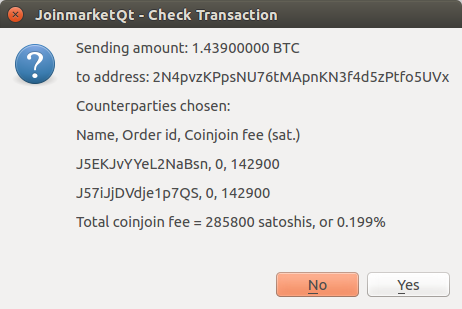

You'll see that 2 (or whatever number you chose) counterparties have been selected. The 
selection is partly random and partly favouring fees as low as possible. The percentage 
fee is shown: in this case, it's 0.199% of 1.439, i.e. 285800 satoshis. Note that (a) this is a fake testing mode transaction, so these figures are not meaningful, but (b) this is the **coinjoin fee**, it does not include the **bitcoin transaction fee** which can be significantly larger, in many cases.

If you don't like the fee, click No and the transaction is just aborted. If you click Yes, 
you are now committed to the transaction; you *can* click "Abort" after this (or indeed before), but it won't be guaranteed that the tx won't go through after this. Assuming all goes well, you will see this:

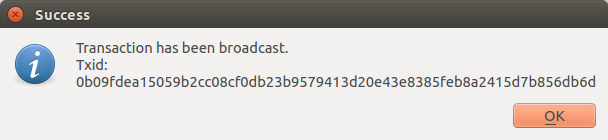

The coinjoin transaction has now been broadcast to the blockchain.

Once the transaction is finished, the Single Join tab will look something like this:

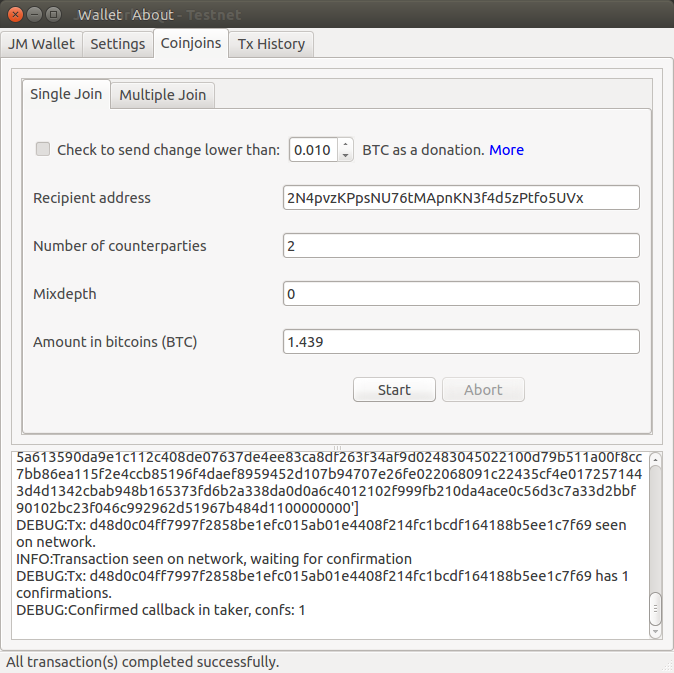

You can refer to the previous transactions you've done in the Tx History tab:

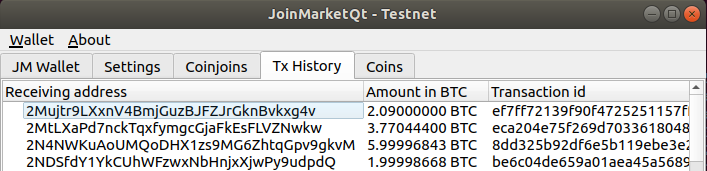

### Tumbler

This walkthrough only showed the introductory steps to doing a first coinjoin. The main additional feature
is "tumbler" algorithm, doing a set of coinjoins to move all coins from the wallet to a set of destinations,
with a much higher degree of privacy. For the fundamental ideas you should start [here](https://github.com/JoinMarket-Org/joinmarket/wiki/Step-by-step-running-the-tumbler); this is *basically* the same, with some extra robustness features (and in a GUI, of course). Start in the "Multiple joins" tab and click the button `Generate Tumble Schedule`. A wizard starts:

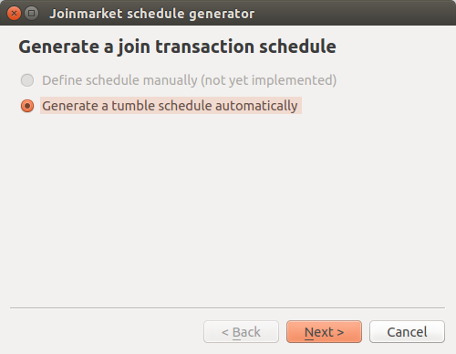

First step is obvious (manual is not yet implemented).

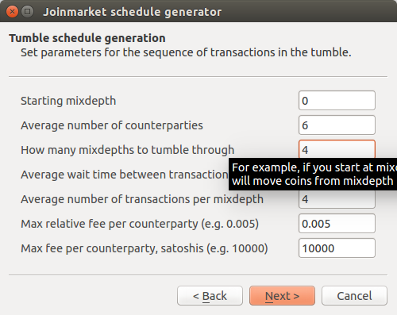

The base set of parameters, you *may* want to change some of these; see the tooltips for further info. Start from the first mixdepth that has coins (0 is the first, the default set is 0,1,2,3,4). You can also have coins in later mixdepths when you start, that's OK. Note that the two fee limits at the end are combined in AND fashion - if only one limit is violated, the fee will be accepted.

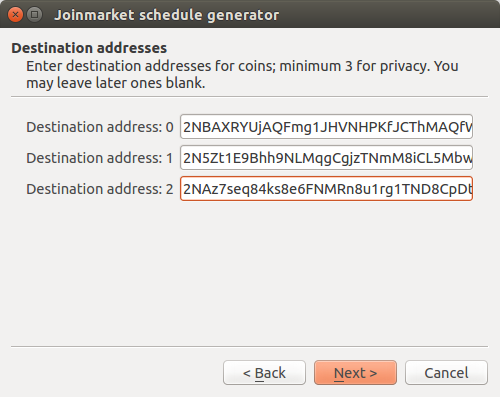

You are advised to have **at least** three destination addresses. The tumbler algorithm really doesn't work if there is only one destination. You can use more than 3, but the number allowed depends on how many mixdepths you tumble through. The option "address ask" is only available in the command line script version.

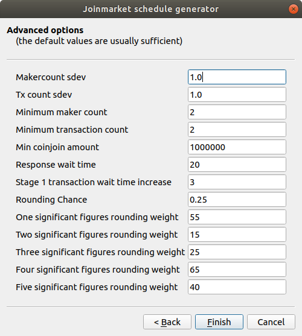

These advanced options are best left unchanged; as usual the tooltips give some further info if you do want to amend them.

On completing the wizard, you will see a new schedule displayed in the tab:

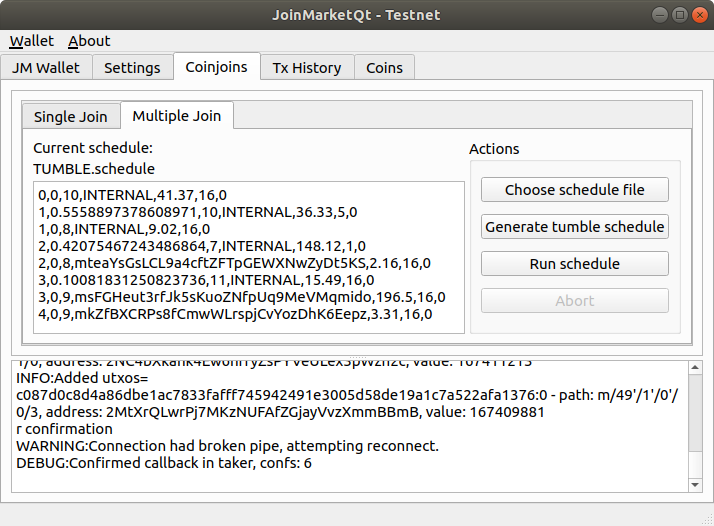

You'll see your destination addresses in the list, and lots of "INTERNAL" meaning transactions that send back to the wallet (in the next mixdepth). Click `Run Schedule` and the tumbler will start. As it progresses, you'll see updates to the schedule (in particular the last entry in each list will change from `0` to `txid` to `1` when finished). The full tumbler run will usually take at least a few hours, as you'll understand if you read the wiki page linked above.

### Sweeps

If you want to send *all* the coins in a specific mixdepth at once, the correct way to do it
is using the "sweep" feature. To do this, simply set the "Amount" field in the Single Join tab to zero. The program will automatically figure out the right output amount after accounting for the coinjoin and bitcoin transaction fees. If you try to send total amount, you will get a "not enough funds" error. Putting it another way, you'll end up with dust in the wallet if you try to send the total without using this sweep feature, so do use it.

### Coins Tab

You can use the coins tab to (a) check the exact utxos owned by your wallet and (b) freeze or unfreeze certain utxos (coins) to allow coin control.

The latter can be done by right clicking on a utxo and choosing "freeze/unfreeze" (the action toggles).

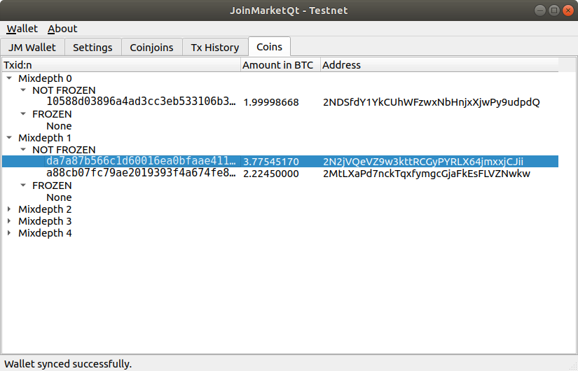

This can be useful if you want to spend from one or more specific utxos. Disable (freeze) the *other* coins in that mixdepth. Remember, Joinmarket will *never* co-spend utxos from different mixdepths (accounts), in any kind of transaction - they are completely isolated accounts.

### Export private keys

**DON'T TRY TO USE THIS USUALLY**.
You should be able to import the wallet into some other wallets, as was mentioned above.
segwit wallets are implemented there. The keys here control coins (utxos), but only according to the p2sh/p2wpkh standard within segwit; if you import them into a random wallet they won't show any coins.

If this feature is still useful for some reason:

In the wallet menu, choose "Export keys" and you will be
shown a list of all the private keys for addresses that currently cointain coins.
Handling private keys is not advisable, even for the experienced Bitcoin user. Disclosing even one BIP32
private key in your wallet can theoretically expose the whole wallet, also.
The keys displayed can be saved to a file if you wish (again, be very careful),
or you can copy-paste them elsewhere. They are in WIF compressed format (start with
K or L on mainnet).
