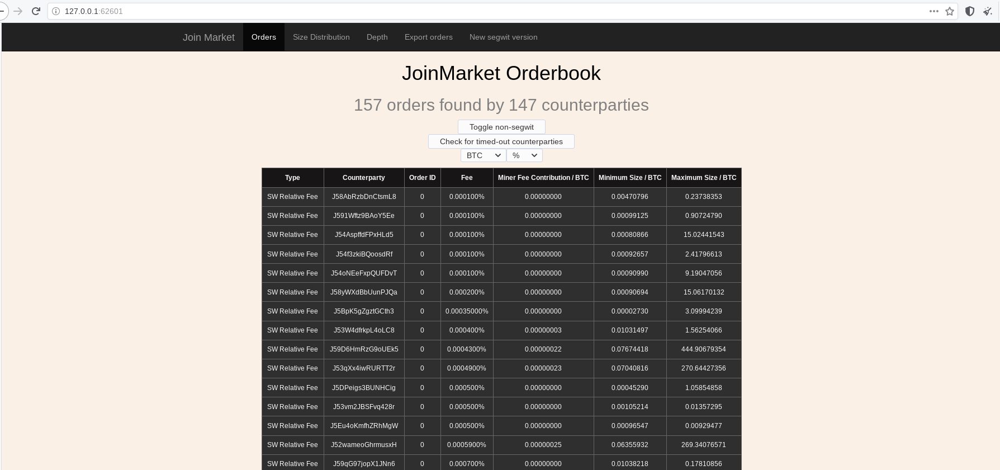

# Orderbook



To setup your own local orderbook, the only thing you need is an install of Joinmarket (you don't need Bitcoin Core for that);
follow either the Quick Install on the readme (`./install.sh`) (RECOMMENDED), or one of the manual installation as per [here](INSTALL.md).

## Configuration

To run the orderbook without access to Bitcoin Core, edit the `joinmarket.cfg` file in your Joinmarket data directory as per below
(NOTE: if you don't have a data directory, it will be created the first time you run the script).

```
[BLOCKCHAIN]
blockchain_source = no-blockchain
```

Comments are omitted; do read them.

You may also want to check the `[MESSAGING:server]` options, e.g., if you want to use IRC Tor onion services you can edit the relevant parts.

## Start

Launch the `ob-watcher.py` script from `scripts/obwatch` as any other Joinmarket script.

`(jmvenv)$ python ob-watcher.py`

Add `-p PORT` to use a custom port (default is equivalent to `-p 62601`).

Then open the link to the just created local server in your favorite browser.